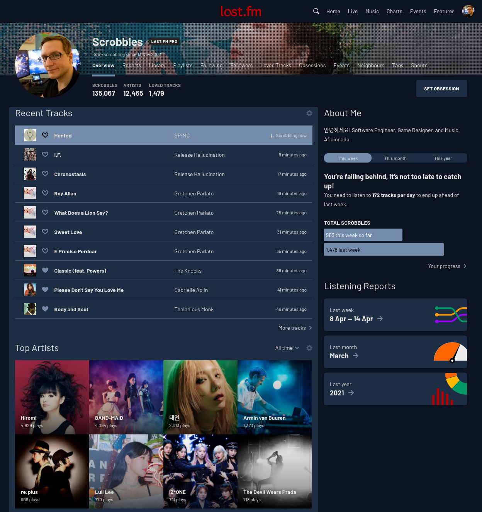

# lastfm-5am

Dark, blueish theme for[last.fm](https://last.fm).

## Usage

**Warning: This is far from complete (most work is done on the /user/\* page) and I don't expect anyone to actually use this.**

Paste / import the `export.css` file into Stylus / compatible CSS styling extension.

## Build

`python compile.py` will create the `export.css` with proper moz-document identifiers appended to each section based off the files in the `src/` directory.
